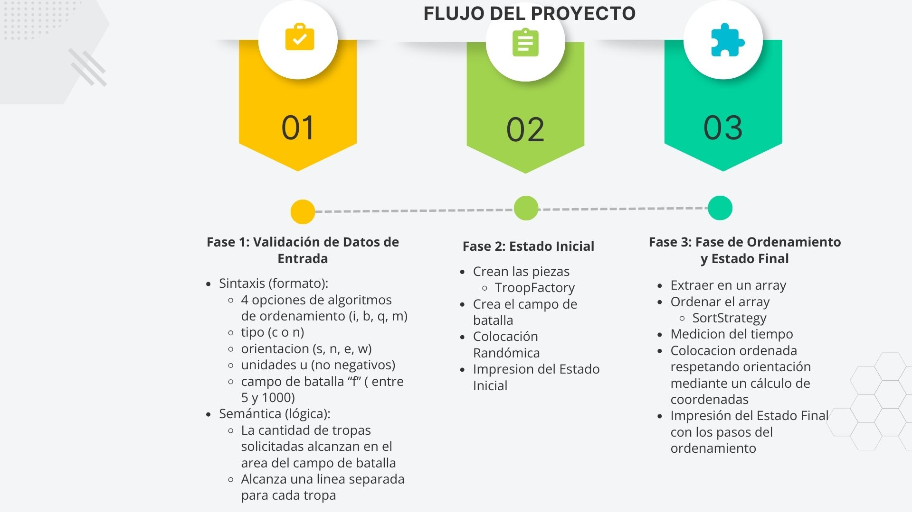
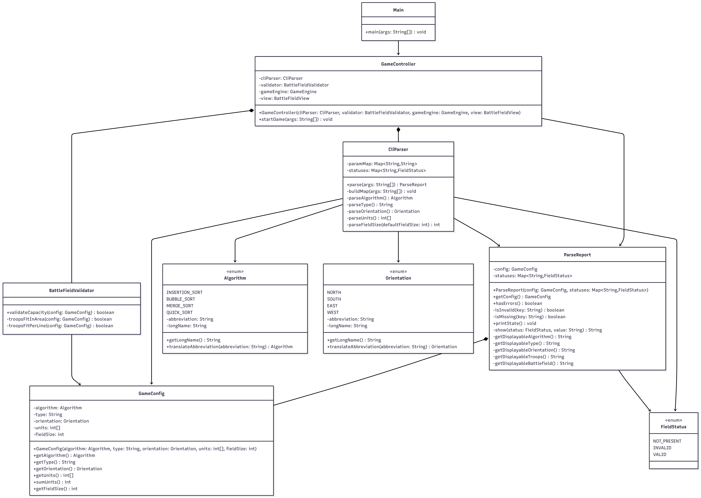
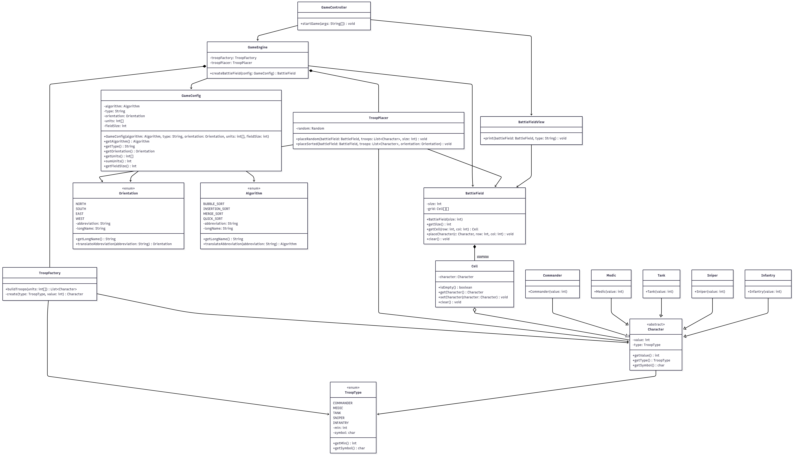
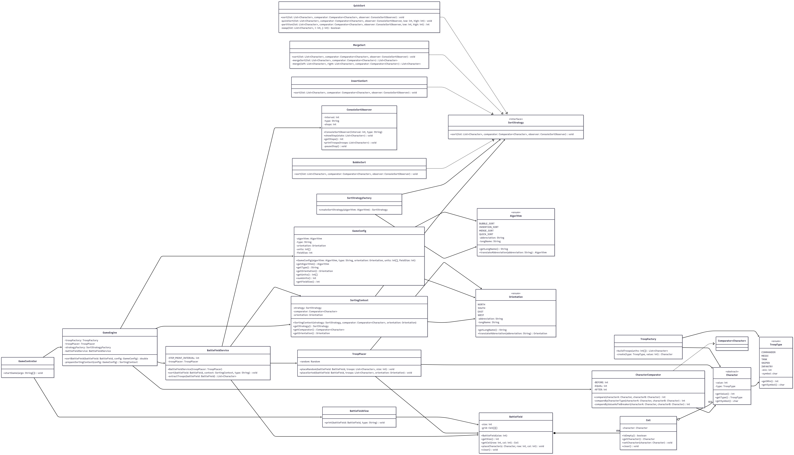
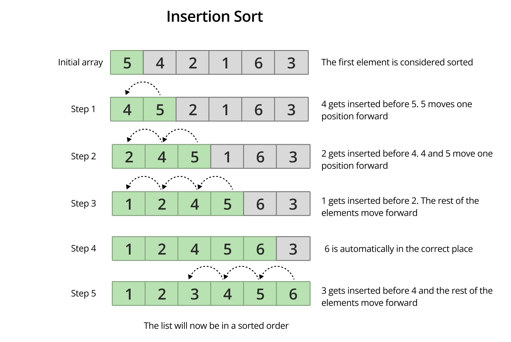
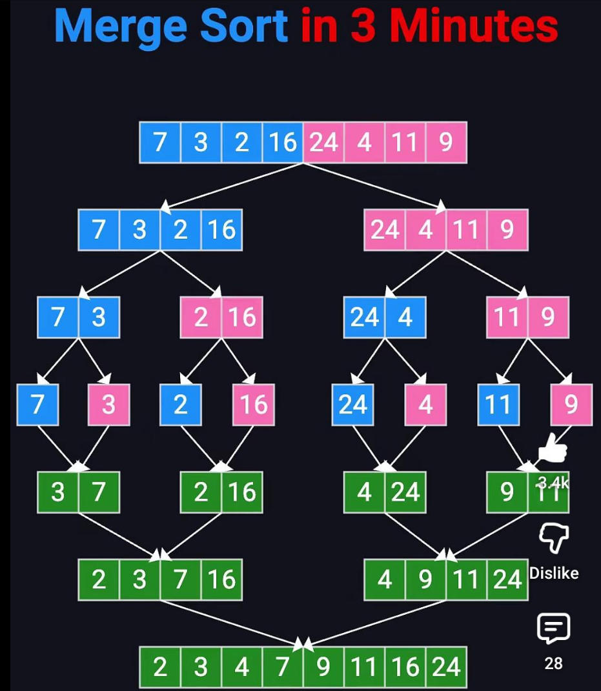
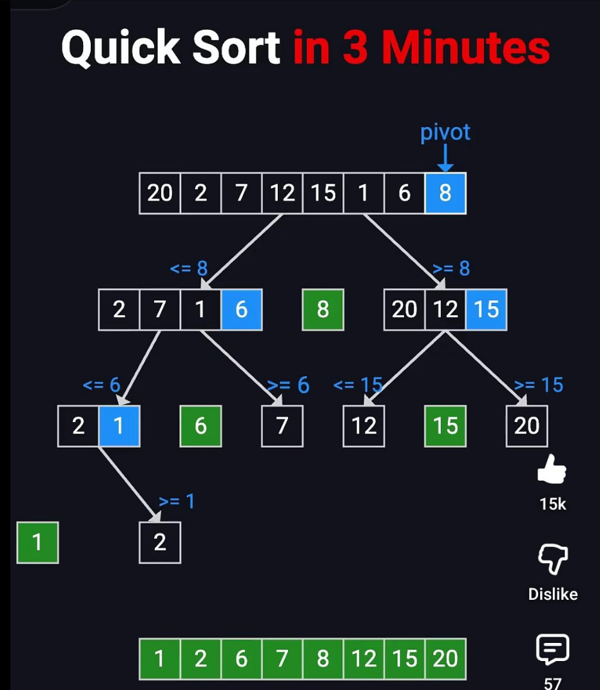
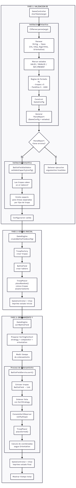

# README

Lilian Laime Lucero

## Project Overview
This project simulates troop creation, validation, battlefield placement, sorting, and final deployment by orientation.

## Project Phases

## Three-Phase Summary
### Phase 1: Validation (Syntax + Semantics)
- `CliParser` validates input format (`algorithm`, `type`, `orientation`, `units`, `field size`) and parses values into domain types.
- `ParseReport` stores both parsed config (`GameConfig`) and status per field (`VALID`, `INVALID`, `NOT_PRESENT`).
- `BattleFieldValidator` checks business rules:
  - troops must fit battlefield area (`N x N`),
  - troop types must fit line constraints.

### Phase 2: Initial Battlefield State
- `TroopFactory` creates troop instances.
- `BattleField` is created as an empty matrix.
- `TroopPlacer.placeRandom(...)` places troops randomly.
- `BattleFieldView` prints the initial state.

### Phase 3: Sorting + Final State
- Troops are extracted from matrix to `List<Character>`.
- Sorting is delegated through `SortStrategy` (Strategy pattern).
- `ConsoleSortObserver` prints visible sorting steps.
- `TroopPlacer.placeSorted(...)` places sorted troops back by orientation.
- `GameEngine` measures total sorting time.

## Applied Principles and Patterns
- Patterns:
  - `Factory`: `TroopFactory`
  - `Strategy`: `SortStrategy`
- Data structures:
  - `HashMap`: parser values and validation statuses
  - `int[]`: troop counts
  - `List<Character>`: sortable troop sequence
  - `Cell[][]`: battlefield matrix
- OOP:
  - Polymorphism:
    - each sorting algorithm behaves differently (`BubbleSort`, `InsertionSort`, `MergeSort`, `QuickSort`)
    - `Comparator.compare(...)` is used as a common comparison contract
  - Encapsulation:
    - private attributes with controlled access through getters/setters
    - private helper methods encapsulate internal logic
  - Abstraction:
    - abstract class `Character` defines common behavior (`getValue`, `getType`) without direct instantiation
    - implementation details are hidden behind shared contracts
  - Inheritance:
    - `Commander`, `Medic`, `Tank`, `Sniper`, `Infantry` inherit attributes and behavior from `Character`
  - Enums: `Algorithm`, `Orientation`, `TroopType`, `FieldStatus`
  - Composition/Aggregation in battlefield and orchestration classes
- SOLID:
  - `SRP`:
    - `CliParser` focuses on syntax validation.
    - `BattleFieldValidator` focuses on semantic validation.
    - `TroopPlacer` focuses on troop placement (`random` and `sorted`).
    - `BattleFieldView` focuses on printing the battlefield.
    - `GameEngine` and `BattleFieldService` orchestration.
    - `GameController` orchestrates the full application flow.
  - `OCP`:
    - New sorting algorithms can be added through `SortStrategy` implementations (`BubbleSort`, `InsertionSort`, `MergeSort`, `QuickSort`) without changing `SortingContext` and `BattleFieldService`.
    - New troop variants can be represented through the `Character` hierarchy.
  - `LSP`:
    - Sorting strategies are substitutable through `SortStrategy`.
  - `ISP`:
    - `SortStrategy` exposes only the common behavior (`sort`) needed by all sorting implementations.
  - `DIP`:
    - Sorting flow depends on abstractions (`SortStrategy`, `Comparator<Character>`), not on a specific algorithm implementation.
- Exception handling:
  - `try/catch` in parser and observer
  - `IllegalArgumentException` for invalid enum abbreviations

## Visuals

### Execution Screenshots
#### Execution 1

#### Execution 2

#### Execution 3

### Class Diagrams
#### Phase 1 Diagram

#### Phase 2 Diagram

#### Phase 3 Diagram

#### General Class Diagram

### Sorting Algorithms
#### Bubble Sort

#### Insertion Sort

#### Merge Sort

#### Quick Sort

Sources:
https://www.geeksforgeeks.org/dsa/bubble-sort-algorithm/

## Project Flow in Detail

