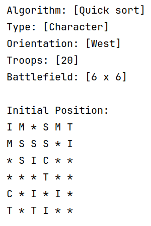
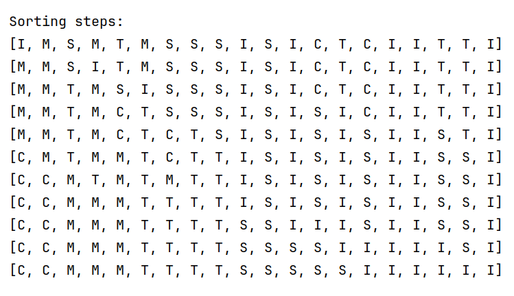
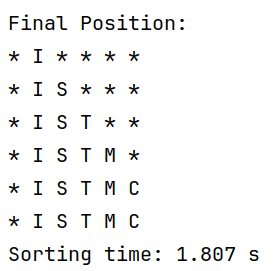
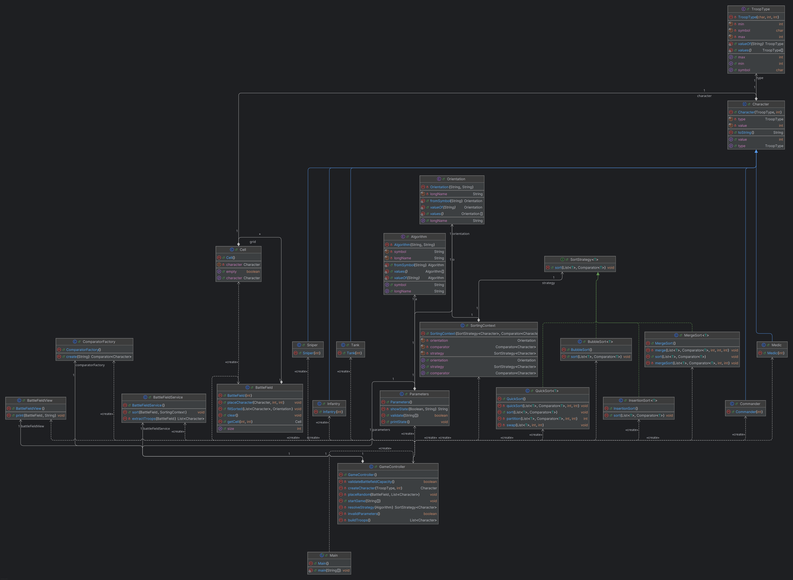

# README

## Execution Flow

1. `controller`: receives CLI arguments and coordinates the flow.
2. `validation`: validates syntax and semantics.
3. `creation`: creates troops and the initial battlefield state.
4. `sorting`: sorts troops and applies the final formation.
5. `view`: prints initial state, intermediate steps, and final state.

## Three-Phase Summary (Key Points)
### Phase 1: Validation (Syntax + Semantics)
- `CliParser` performs syntax/format validation based on input rules (`algorithm`, `type`, `orientation`, `units`, `battlefield size`).
- Parsing converts raw strings into domain types (`Algorithm`, `Orientation`, `int[]`, `int`) and builds `GameConfig`.
- `ParseReport` stores both parsed config and per-field status (`VALID`, `INVALID`, `NOT_PRESENT`).
- `BattleFieldValidator` performs semantic checks:
  - total troops must fit battlefield area (`N x N`);
  - troop distribution must fit separate lines per troop type.

### Phase 2: Initial Battlefield State
- `TroopFactory` creates troop instances (`COMMANDER`, `MEDIC`, `TANK`, `SNIPER`, `INFANTRY`).
- `BattleField` is created as an empty matrix.
- `TroopPlacer.placeRandom(...)` places troops randomly.
- `BattleFieldView` prints the initial state.

### Phase 3: Sorting + Final State
- Troops are extracted from matrix (`BattleField`) to `List<Character>`.
- Sorting is delegated through `SortStrategy` (Strategy pattern).
- `ConsoleSortObserver` reports visible sorting steps.
- Sorted troops are placed back into the matrix using orientation-aware coordinate logic (`placeSorted(...)`).
- Execution time is measured in `GameEngine.sortBattleField(...)` and shown in seconds.

## Package Responsibilities
- `controller`
  - `GameController`: orchestrates the end-to-end use case.
- `orchestration`
  - `GameEngine`: creates the field and prepares/executes sorting.
  - `BattleFieldService`: extracts troops, sorts, and places them back.
- `validation.syntax`
  - `CliParser`, `ParseReport`, `FieldStatus`.
- `validation.semantic`
  - `BattleFieldValidator`.
- `creation`
  - `TroopFactory`, `TroopPlacer`.
- `creation.model` and `creation.model.character`
  - Domain entities (`BattleField`, `Cell`, `Character`, subtypes, enums).
- `sorting` and `sorting.algorithms`
  - Strategy contract, context, comparator, observer, factory, and algorithms.
- `view`
  - `BattleFieldView`: console output.

## Applied Principles and Patterns
- Patterns:
  - `Factory`: `TroopFactory`.
  - `Strategy`: `SortStrategy` + algorithms (`BubbleSort`, `InsertionSort`, `MergeSort`, `QuickSort`).
- Data structures:
  - `HashMap`: parser input map + validation status map.
  - `int[]`: troop counts from input.
  - `List<Character>`: sortable troop collection extracted from the matrix.
  - `Cell[][]`: battlefield matrix.
- OOP:
  - `Abstraction`: abstract `Character` and `SortStrategy` interface.
  - `Inheritance`: `Character` subtypes.
  - `Polymorphism`: use of `SortStrategy` and `List<Character>`.
  - `Encapsulation`: private/final fields and controlled access.
  - `Enums`: `Algorithm`, `Orientation`, `TroopType`, `FieldStatus`.
  - `Composition/Aggregation`: `BattleField` -> `Cell[][]`, `Cell` -> `Character`, orchestrator classes with constructor-injected dependencies.
- SOLID (current status):
  - `SRP`: mostly well applied across classes (parser, validator, factory, placer, view, strategies).
  - `OCP`: applied in sorting strategy; partial in `switch`/`enum`-based factories.
  - `LSP`: `Character` subtypes and sorting strategies are substitutable.
  - `ISP`: not a strong focus at this project size (mainly `SortStrategy` interface).
  - `DIP`: partial; stronger in sorting module (abstractions), weaker where controller/engine depend on concrete classes.
- Exception handling:
  - `CliParser`: `try/catch` for parsing algorithm, orientation, units, and field size.
  - `ConsoleSortObserver`: handles `InterruptedException` on step delay.
  - `Algorithm` / `Orientation`: throw `IllegalArgumentException` for invalid abbreviations.

## Algorithms
Sources:
https://www.geeksforgeeks.org/dsa/bubble-sort-algorithm/

## Diagrams
- Detailed class diagrams by phase:
  - `CLASS_DIAGRAM.md`

## Visual Evidence

